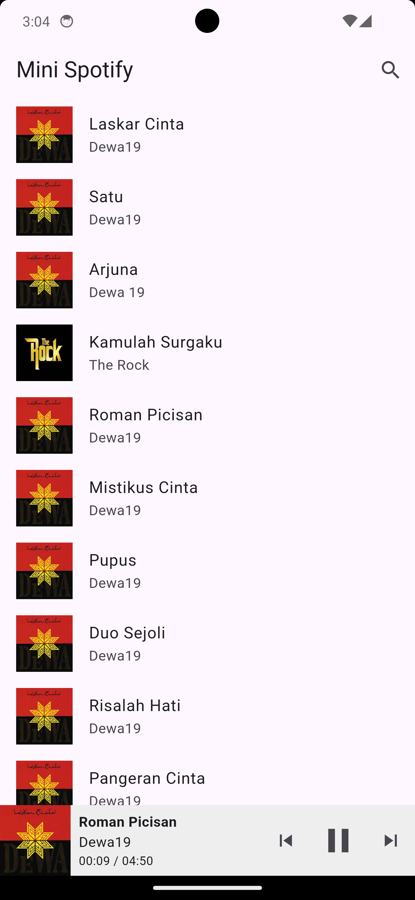
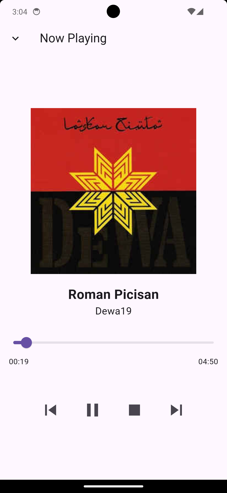
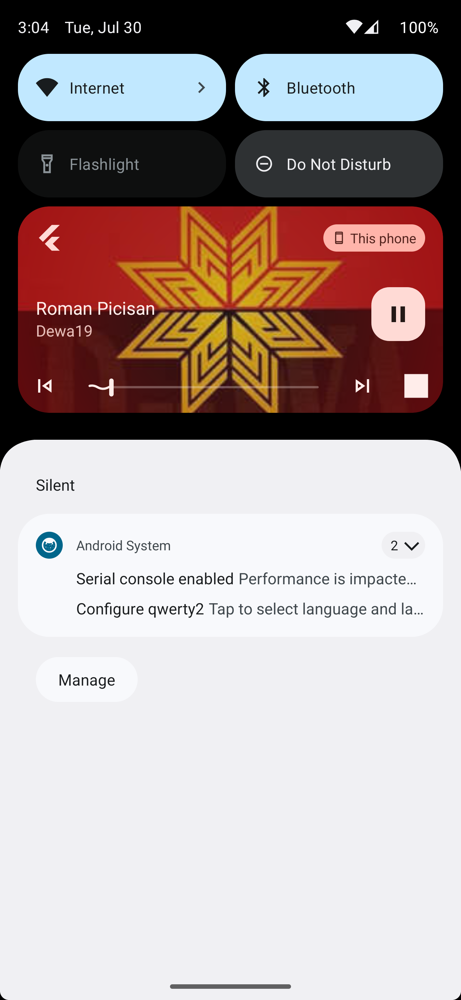
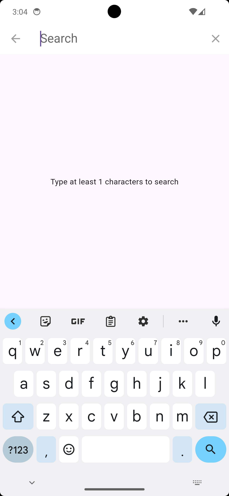
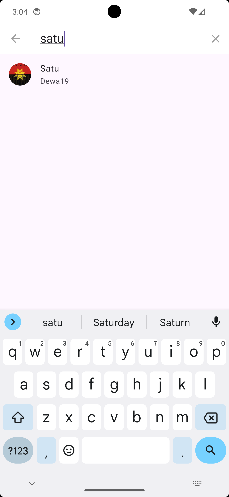

# Flutter Spotify Clone

A minimalist Spotify-like music player built with Flutter and BLoC pattern.

## Features

- Browse and search for songs
- Play, pause, and stop songs
- Skip to next or previous track
- Seek within a song
- Mini-player at the bottom of the home screen
- Full-screen player with album art and controls
- Playback song and notification

## App Preview

 

